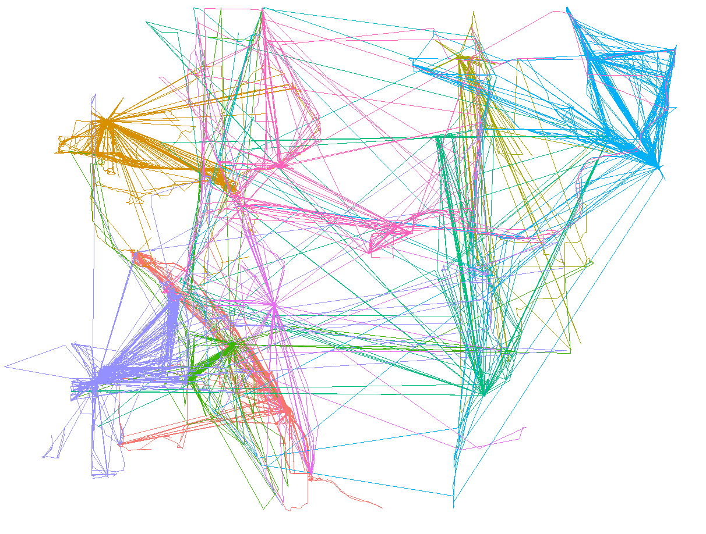
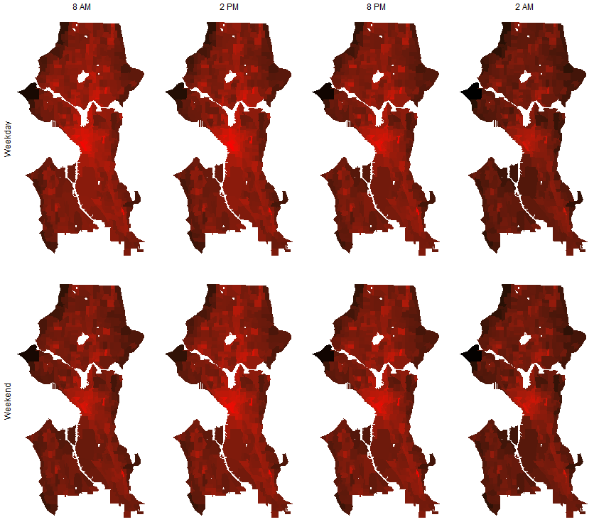
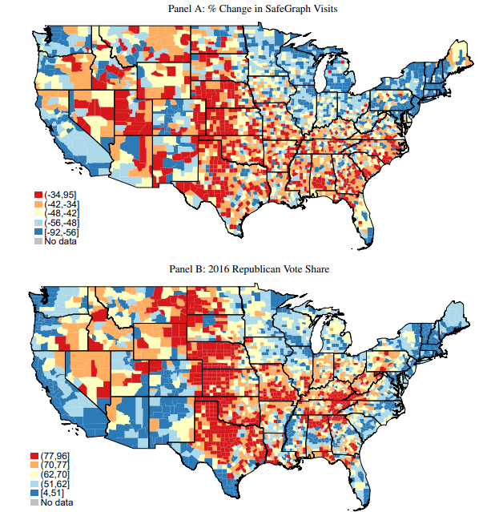

```{r, include=FALSE}
library(tidyverse)
```

# Quick Notes

The data described today were acquired by Adrian Dobra, UW Statistics.

He is seeking collaborators with interesting research ideas.
* Use agreement: Adrian must be PI for data to be used on a project.
* Research areas wide open

The data are *incredibly* rich and clean; the main barriers are computation and imagination.


---
# App Location Data

You may have seen [recent New York Times articles](https://www.nytimes.com/interactive/2019/12/19/opinion/location-tracking-cell-phone.html) on application location data.
* NYT obtained 50 billion locations over a few months on 12 million Americans
* Able to track congresspeople, Secret Service agents, etc.

These are GPS location pings from phone apps.
* Precise locations
* High variability in reporting depending on app
   + Sometimes *incredibly frequent*--can determine exact movement speed.
* Usually no data except user ID and locations

---
# SafeGraph

* [Geospatial data company](https://www.safegraph.com/)
* Aggregate data from many sources, verify and clean
   + Most is cellular phone application geolocations.
* Sell for marketing purposes
   + Usually only aggregated data
   + Ex: Number of people in a census block at given time/day
   + Ex: Number of people traveling from block A to block B each day
* Briefly had an academic partnership program allowing researchers to download *raw, non-aggregated data*.
* [Started a shelter-in-place analytics dashboard recently](https://www.safegraph.com/dashboard/covid19-shelter-in-place)

---
# SafeGraph Public Data

Even SafeGraph's public use data are remarkably powerful.

Example: [Neighborhood Patterns](https://docs.safegraph.com/docs/neighborhood-patterns)
* Census Block Group (CBG) data
   + Hour of day number of visits
   + Day of week visits
   + Home and work CBGs of visitors
* October 2018 data are open access

Example: [County-Level Sociodemographic Data](https://github.com/JieYingWu/COVID-19_US_County-level_Summaries)
* County observations
* SafeGraph Shelter-in-Place Analytics Data
* Over 300 additional sociodemographic measures

---
# These Data

Clean individual-level location trace data from apps--the foundation for SafeGraph's aggregate products. Adrian has entire United States, but Washington is illustrative subsample.

### Washington subsample

* 25 billion observations
* 7 million unique IDs
   + These are *device IDs* not necessarily individuals
   + 100k+ observations not uncommon
* 780 thousand WA home locations
   + Probabalistically matched to block groups
   + Also have non-WA home locations (80 million)
* 3 month period: November 2018 - January 2019
* Biggish Data
   + 140 gigs of `.csv` files for WA

---
# Codebook

.smallish[
```{r, echo=FALSE}
gt::gt(tribble(~Field, ~Description, ~Type, ~Example,
"utc_timestamp", "Timestamp in UTC", "Long", "1469356584",
"caid", "An ID that uniquely and anonymously identifies the device from which the location record originated. This is consistent over time for a given device.", "String", "1bb6d96c2c41f...",
"id_type", "Indicates whether device is Android or iOS", "String", "idfa, gaid / aaid",
"geo_hash", "Geohash of the lat/long", "String", "9q8yym4cy",
"latitude", "Coordinate", "Float", "37.776801",
"longitude", "Coordinate", "Float", "-122.416601",
"horizontal_accuracy", "Estimate of the radius of uncertainty of the location measurement as defined by the Apple or Android device (meters)", "Float", "5.0"))
```
]

---
## Raw Washington Data

* 11,921 gzipped `.csv` files
   + Organized by month and day
   + 128 files per day
   + 25.7 GB total

## Adrian's Data Structure

* 100 "group" `.csv` files
   + 25 million rows each
   + All observations for a given individual in single file
   + 138 GB total
* User index file
   + Indicates which group file contains individual's data

---
# Main Challenges for Use

* Measurement
   + From intermittent geolocations to time spent in places
   + Going from locations to time/space movement
* Memory
   + Too large for memory means working in batches
   + Writing intermediate files to disk
   + Must pay attention to indexing and file referencing
* Processing
   + Spatial operations frequently scale poorly
   + Common methods often time prohibitive

Memory and processing issues common to all large data, but measurement presents unique challenges.

---
class: inverse
# Some Examples

---
## 10 users, first 100k locations each

.image-full[

]

---
## Hour of Day Densities

.image-full[

]

---
## Hour of Day Densities

.image-full[

]

---
## Social Distancing and Partisanship

.image-full[

]

.footnote[[Source: Allcott et al. 2020](http://web.stanford.edu/~gentzkow/research/social_distancing.pdf)]
---
# Some Ideas

* Hour-of-day street population counts (stocks)
   + Probabilistically assigned demographics
   + Routine Activities in Criminology
   
* Neighborhood connectedness (flows)
   + Fine-level census block or block group dyadic flows
   + [Sampson, Small, and others doing this with Twitter](https://doi.org/10.1073/pnas.1802537115)
   
* Ecological networks
   + Time/space overlap of individuals
* Estimating exposures (pollution, crime, etc.)

* Small time/space mobility estimation
   + Possibly route and mode specific

---
# What We're Looking For

* High-impact applications
   + Long-standing theoretical questions
   + Testing assumptions of theories
   
* Straightforward applications

* Time-sensitive questions
   + These are recent data!

